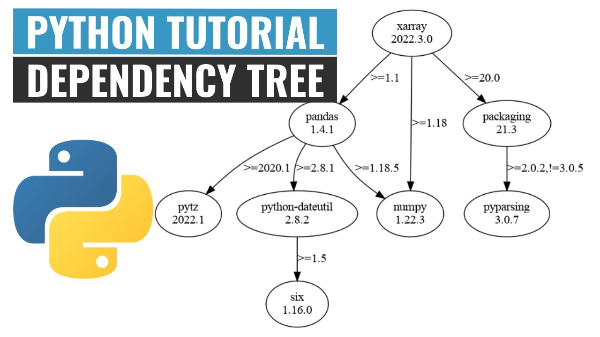

## npm init 是做什麼的？
輸入這個指令後會初始化一個新的 Node.js 專案，並且生成一個名為 package.json 的檔案。這個檔案會包含專案的基本資訊，例如專案名稱、版本、描述、相依的套件等等。
- name：專案的名稱。
- version：專案的版本，默認為 1.0.0。
- description：專案的描述。
- entry point：專案的進入點，默認是 index.js。
- test command：執行測試時使用的命令。
- git repository：專案的 Git repo 的 URL。
- keywords：描述專案的關鍵字列表。
- author：專案的作者。
- license：專案的授權協議，默認是 ISC。
  - `https://zh.wikipedia.org/zh-tw/ISC%E8%A8%B1%E5%8F%AF%E8%AD%89`

如果不想要逐步回答每一個問題，可以使用 `npm init -y` 或 `npm init --yes`~

## 要有 package.json 幹什麼？
package.json 是專案的核心檔案，記錄了所有檔案的 dependencies、scripts，以及其他與專案相關的重要資訊。當你想要安裝、更新或移除時，npm 會參考這個文件。
換句話說，當你安裝任何 npm 模組時，這些模組及其版本會被記錄在 package.json 中。這樣，其他開發者只需要執行 `npm install` 就能安裝所有專案所需的dependencies。

TIPS：初始化後的 package.json，可以看到裡面有以下程式
```
"scripts": {
    "test": "echo \"Error: no test specified\" && exit 1"
}
```

### "scripts" 欄位定義了一系列可執行的 script ，這些 script 可以通過 `npm run <script-name>` 來執行。可以使用這些 script 來簡化常用的操作，例如執行測試、編譯、啟動伺服器等。

## 當我執行 `npm install express` 發生了兩件事
### 1. 生成 `package-lock.json` 檔案
作用：
package-lock.json 文件記錄了專案中所有安裝的 dependencies（包括 Express 和其間接dependencies）。它的主要作用是鎖定 dependencies 的版本，以確保所有開發者或伺服器在安裝時獲得完全相同的dependencies tree。


超級簡單的說：package-lock.json是在npm install時後生成一份文件，用以紀錄當前狀態下實際安裝的各個npm package的具體來源和版本號。

### 2. `node_modules` 資料夾
這個就很好理解，使用 `npm install <Project name>` ，就是把該專案的程式碼下載到node_modules 資料夾中，其中包含專案中所有安裝的 npm modual 及其 dependencies。當你執行 npm install 時，npm 會下載所有 dependencies 並將它們存儲在 node_modules 資料夾中，這樣專案就可以正常使用這些Library。

## 那有了package.json、需要 package-lock.json 幹嘛？
關於 package.json、package-lock.json 的相關測試、實驗<br>
https://juejin.cn/post/7154286768466952222 <------ 超讚
## package.json、package-lock.json、node_modules 是否應該加入版控？
結論如下：
- `package.json` 應該加入版控，文件包含了專案的關鍵資訊
- `node_modules` 不應加入版控，因為這裡面的程式碼可以通過 npm install 去下載，所有dependencies 的資訊都已經在 package.json 和 package-lock.json 中記錄好了
- `package-lock.json` 該加入版本控制，因為它可以保證版本的一致性。

##  `npm install express` 前後差異
install 前
```json
{
  "name": "backend",
  "version": "1.0.0",
  "main": "index.js",
  "scripts": {
    "test": "echo \"Error: no test specified\" && exit 1"
  },
  "author": "",
  "license": "ISC",
  "description": "My first Node.js project"
}
```
<br>

install 後多了 `dependencies` 並且 `package-lock` 暴增一堆東西
```json
{
  "name": "backend",
  "version": "1.0.0",
  "main": "index.js",
  "scripts": {
    "test": "echo \"Error: no test specified\" && exit 1"
  },
  "keywords": [],
  "author": "",
  "license": "ISC",
  "description": "",
  "dependencies": {
    "express": "^4.21.0"
  }
}
```
## ==== 以上是我邊做邊對自己提出的問題並整理起來，結果做到後面發現老師在作業最後也有提一些問題，有些跟我上面甚至上週想的有重疊到，以下就按照老師提問的順序回答 ====


## package.json 中的 dependencies 與 devDependencies 分別是什麼？
我目前在 package.json 沒有看到 `devDependencies`，上網查了以下資訊
| 屬性 | dependencies | devDependencies |
| :----:|:----:|:----:|
|安裝時間|在生產環境和開發環境中都會安裝|只在開發環境中安裝（除非特別指定 `npm install --only=dev`）|
|常見用途|框架（如 Express、React）、資料庫（如 Mongoose）|測試工具（如 Mocha）、Linter（如 ESLint）、打包工具（如 Webpack）|
|部署到伺服器|必須安裝，因為應用程式需要它來運行|不需要安裝，因為只在開發時才需要|

## 關於 `"scripts"`
"scripts" 欄位定義了一系列可執行的 script ，這些 script 可以通過 `npm run <script-name>` 來執行。可以使用這些 script 來簡化常用的操作，例如執行測試、編譯、啟動伺服器等。

## Port number 要怎麼以環境變數來設定？
使用 `process.env` 來讀取環境變數，也就是
```Javascript
const port = process.env.PORT || 3000;
```
這樣，伺服器會先從環境變數中讀取 `PORT`，如果沒有設置，則默認使用 3000。
   
設定環境變數有以下三種方法：
1. CLI 設定環境變數
   ```bash
   // Linux / macOS
   PORT=8080 node app.js

   //Windows 
   set PORT=8080 && node app.js
   ```
2. 使用 `.env` 設定環境變數並透過 `dotenv` 將其加載到程式中
   - `npm install dotenv`
   - 創建 `.env` 文件，並輸入 `PORT=8080`
        ```javascript
        require('dotenv').config();

        const express = require('express');
        const app = express();

        const port = process.env.PORT || 3000;
        ```
3. 在伺服器管理工具中設置環境變數
   - Heroku： `heroku config:set PORT=8080`
   - Docker： 可以在 `Dockerfile` 或 `docker-compose.yml` 中設置環境變數
        ```yaml
        environment:
        - PORT=8080
        ```


## 在上週執行stack的檔案遇到了以下問題
## Issue：(node:21376) Warning: To load an ES module, set "type": "module" in the package.json or use the .mjs extension.

Nodejs 有兩個模組系統 `CommonJS` 和 `ES Modules`
### CommonJS 模組系統
- CommonJS 是 Node.js 中較早的模組系統，也是 Node.js 的預設模組系統。
- 語法： 使用 require 來匯入模組，使用 module.exports 或 exports 來匯出模組。
```Javascript
// 定義模組 (moduleA.js)
const hello = 'Hello, CommonJS!';
module.exports = hello;

// 使用模組 (main.js)
const hello = require('./moduleA.js');
console.log(hello);  // 輸出 "Hello, CommonJS!"
```

### ES Modules（ESM）模組系統
- ES Modules 是近代比較常用模組系統，尤其是與瀏覽器相容。
- 瀏覽器和 Node.js 都支援 ES Modules。對於前端和後端共享程式碼的專案（如 Isomorphic/Universal JavaScript 應用程式），ESM 能讓開發者使用相同的模組系統，降低維護成本。
- 語法： 使用 import 來匯入模組，使用 export 來匯出模組。
```Javascript
// 定義模組 (moduleA.mjs)
export const hello = 'Hello, ES Modules!';

// 使用模組 (main.mjs)
import { hello } from './moduleA.mjs';
console.log(hello);  // 輸出 "Hello, ES Modules!"
```
### 為什麼要改成 ES Modules ?
- JavaScript 的官方標準
- 瀏覽器和 Node.js 的一致性
- 模組的靜態分析
  - 這意味著在Compile Period可以確定所有的關係
  - 動態分析依賴於程式實際運行時的狀態和行為，而不是單純依賴於程式碼本身。
- 更好地支持工具和框架
  - 許多新的開發工具和框架（例如 Rollup、Snowpack、Vite）都更傾向於使用 ESM。
### 什麼時候選擇 CommonJS？
ESM 正逐漸成為標準，但在某些情況下，仍然可能選擇使用 CommonJS：
- 需要支援非常舊的 Node.js 版本（如 Node.js 10 或更低）。
- 專案仍然使用 CommonJS，且轉換為 ESM 會引入大量的開發成本。
- 進行POC，省去額外的設定。因CommonJS 是 Node.js 的預設模組系統