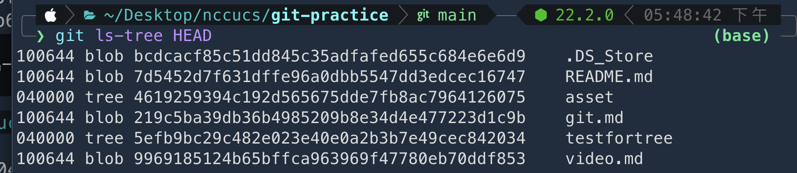
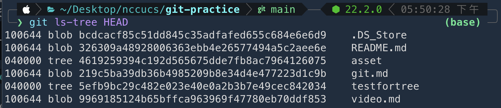
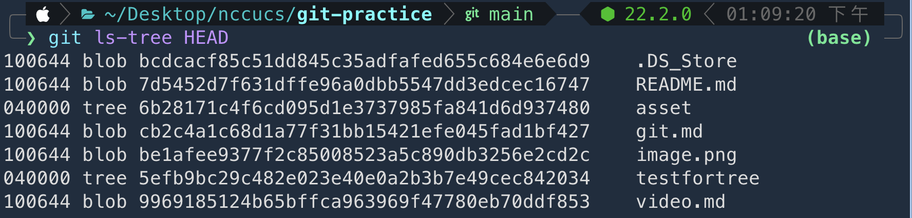
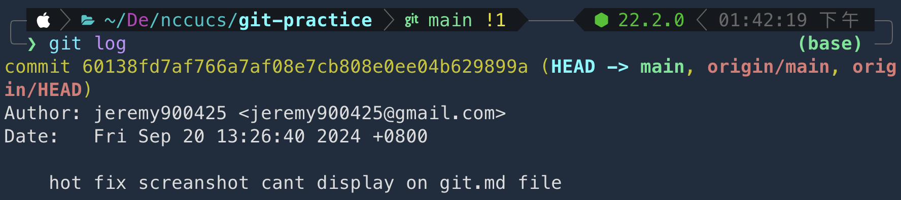

# Git 基本概念

## 1. **Blob**
- **Blob** 是 Git 中儲存檔案內容的單位，每個檔案的內容都會被 Git 轉成一個 blob，並用一個獨特的編號來標識它，此編號是SHA-1 (SHA-1是一種 hash 演算法，它可生成 160 bit (20 byte) 的 hash 值，通常以 40 個十六進位 (hex) 的數字表示)

## 2. **Tree**
- **Tree** 是用來表示目錄的資料結構。它包含檔案（blob）和資料夾（其他 tree）。Tree 就像是一個資料夾，它告訴我們有哪些檔案，這些檔案指向的是哪些 blob。

### Lab for Blob & Tree
    $ cd 專案資料夾
    $ git ls-tree HEAD
    # 這裡的 HEAD 可改為其他commit的hash值 e.g. a1b2c3d4
此時可以看到如下資訊


這時我修改README.md的內容，並送出一個commit，並重新輸入 “git ls-tree HEAD” 指令
可以發現README.md 的 blob值被更改了 ！！！這裡放錯圖稍晚會修正


接下來，我們來看看 tree是什麼

    $ mkdir testfortree
    $ cd testfortree
    $ touch test.txt
    $ 提交一次commit
    $ git ls-tree HEAD
可以得到以下結果

此時可以發現"資料夾"被用tree的方式儲存

One more things：
- 你應該注意到了圖片最左邊有 100644, 040000的編號的用途是Git 中的文件模式（file mode），它們表示文件或目錄的權限和類型。這些模式與 Unix/Linux 文件系統的權限模式類似，用來標記文件是普通檔案、可執行檔還是目錄。
  - 100644：普通文件，擁有者可讀寫，其他人可讀。
  - 100755：可執行文件，擁有者可讀寫執行，其他人可讀和執行。
  - 040000：目錄。

```code
～小總結～
只要某個資料夾裡面有 N 個 file or folder，那 blob + tree 的數量一定會等於 N
並且 blob 和 folder 都是使用 SHA-1 編碼而成的，只要檔案變更過git就會賦予新的SHA-1值
```
## 3. **Commit**
- **Commit** 是一個儲存點，記錄了檔案在某個時間點的狀態。每次提交（commit）後，Git 都會記住當前的檔案和目錄狀態，方便未來查詢。

#### Lab for commit. Question：每次commit時，git 是如何記錄資訊的？
使用 `git log` 可以看到以下內容

可以發現也有hash值為 `60138fd7af766a7af08e7cb808e0ee04b629899a` <br>
我們使用以下指令去該檔案中查看其內容

    $ git cat-file -t 60138fd7af766a7af08e7cb808e0ee04b629899a
        tree 51e59b0b6f164edeccfc6270027a317579c8e9b6
        parent 8abfefc641b26d1baee49b562e168f04731f525f
        author jeremy900425 <jeremy900425@gmail.com> 1726810000 +0800
        committer jeremy900425 <jeremy900425@gmail.com> 1726810000 +0800
        hot fix screanshot cant display on git.md file

    $ git cat-file -p 60138fd7af766a7af08e7cb808e0ee04b629899a
        commit
 commit物件：會顯示提交資訊、作者、提交者、提交時間、指向的 tree 物件等資訊
 如果進一步去查看 `51e59b0b6f164edeccfc6270027a317579c8e9b6` 會發現這就是本次提交的檔案，`8abfefc641b26d1baee49b562e168f04731f525f` 就是這個commit的爹爹，其餘就是作者以及commit message.

 ```code
～小總結～
commit 也跟 blob & tree 一樣擁有 hash 值和一份實體檔案，透過 git cat-file -t hash_value ，可以直接查看該檔案中本次commit的詳細資訊
```


## 4. **Branch**
- **Branch** 是 Git 中的一條開發分支，它讓大家可以同時進行不同的開發。每個分支都是一個指向特定 commit 的指標。例如： `main` 就是其中一個分支。

### Lab for Branch. Question: 請問git 是如何保存branch的？
首先確認目前head指向最新的commit，hash值為 `134ba63067b54682ba9b85e2697380072d3e5153`

可以前往 `.git/refs/heads/` 會發現有個 `main`檔案，點開就會發現記錄著 `134ba63067b54682ba9b85e2697380072d3e5153`

接著使用以下指令新增一個分支

    $ git branch test＿branch

此時觀察資料夾 `.git/refs/heads/` ，會發現多了一個 `test_branch`檔案，點開也是記錄著一個hash值，如下所示<br>


#### One more thing：如果輸入 `git reset hash_value` 到之前的版號，可以發現 `.git/refs/heads/main` 中的hash值也會跟著變化，這意味著git 使用這樣的方式記錄著「該branch指向的是哪一個commit」

#### 例如現在 `HEAD` 指向 `676e`, branch 指向 `a17e`

---
#### 會發現兩個file的hash值有符合

---
接下來把HEAD reset到之前的版本 `60138fd7af766a7af08e7cb808e0ee04b629899a`
查看兩個file

你就會發現hash也跟著改了

 ```code
～小總結～
分支都是在 `.git/refs/heads/` 下進行維護，其中 檔案名稱 ＝ 分支名稱 ，某格檔案下的 hash值就是該分支目前所處的 commit hash值
```

## 5. **HEAD**
- **HEAD** 是 Git 中的指標，指向我當前所在的分支或 commit。當我切換分支或回到舊的Commit，HEAD 也會隨之改變。

- `HEAD`指標會參考 `.git/HEAD`，而這份 file 裡面寫著 `ref: refs/heads/main
` 做過剛剛的branch lab 應該就知道 `refs/heads/main` 是做什麼了吧？！

 ```code
～小總結～
HEAD 直接 refs/heads/main 所記錄的 commit，也就是main紀錄著abc123，HEAD就指向abc123;main紀錄著xyz456，HEAD就指向xyz456
```

---

# .git 資料夾的變化

### 1. **初始化 (`git init`)**
- 使用 `git init` 建立一個 Git 專案時，Git 會創建 `.git` 資料夾，裡面包含 Git 追蹤版本變化所需的資料。

### 2. **提交 (`git commit -m "first commit"`)**
- 提交後，會在 `.git/objects/` 中看到一些新增的檔案，這些是 Git 用來儲存提交內容的地方。

### 3. **建立分支 (`git branch`)**
- 當建立一個新分支時，`.git/refs/heads/` 資料夾會新增一個檔案，這檔案記錄了分支指向的 commit。

---

# Commit message 應該怎麼寫？

寫清楚的 commit message 可以有效的和其他開發者共享每次修改的目的及內容。

### 1. **簡明扼要**
- 用一行簡短描述你做了什麼，建議不超過 50 個字。

### 2. **動詞開頭**
- 使用祈使句，動詞開頭（如 Add, Fix, Update）。例如：`Fix login bug` 或 `Add user authentication`.

### 3. **詳細說明**
- 如果變更複雜，可以加上更詳細的描述，說明為什麼進行這次修改。

### 其他範例：
- 截錄自國外 AngularJS 團隊，由 [iThome](https://ithelp.ithome.com.tw/articles/10228738) 提供資料

#### Header: `<type>(<scope>): <subject>`
- **type**: 代表 commit 的類別，必要欄位。可選類別如下：
  - `feat`: 新功能
  - `fix`: 修復 bug
  - `docs`: 文件變更
  - `style`: 格式（不影響功能的修改）
  - `refactor`: 程式重構
  - `test`: 新增測試
  - `chore`: 其他項目
- **scope**: 代表 commit 影響的範圍，例如資料庫等。此為可選欄位
- **subject**: 代表此 commit 的簡短描述，必要欄位，注意：
  - 不要超過 50 個字元。
  - 結尾不要加句號。

#### Body:
- Body 部分是對本次 commit 的描述，建議使用 72 字以內
- 說明程式碼變動的項目與原因，還有與先前行為的對比。

#### Footer:
- issue 編號（如果有的話）。
- 如果有重大變更導致不兼容，使用 `BREAKING CHANGE` 標示，並描述變更內容、變更原因及遷移方法。

