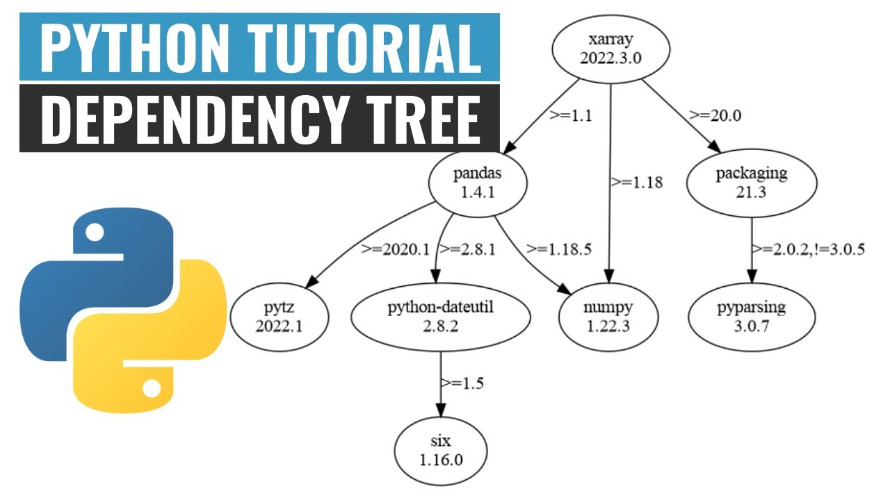

# Week-03 作業
## 什麼是 AWS Region, AZ (availability zones)？
AWS會在世界各地建立他們的基礎設施，也就是常聽的Infrastructure，先看以下這張圖

- 在一個實體地區中對應倒的就是AWS的 `Region`
- 而在一個 `Region` 上會建立多個 `AZ` 我們會說這是一個 `Logical Data Center`
- 進一步看在 `AZ` 上會有多個 `實體的資料中心(Physical Data Center)`
## Region 和 AZ 的特性
- Region：每個 Region 之間是完全隔離的，因此在一個 Region 中發生的故障不會影響其他 Region。
- AZ：每個 AZ 是彼此隔離的、不同的資料中心，但它們透過高速網路相互連接。另外，AZ 的設計目的是提高高可用性和容錯能力，因為即使一個 AZ 出現問題，服務還可以從另一個 AZ 繼續運行。
## AWS VPC？
`AWS VPC` 是一個虛擬的網路區域，我們會把 `EC2` 放在此處，來管理網路的資料傳輸。另外在VPC上也很許多的`Subnet`，概念上就是一個更小的虛擬網路區域，而每個 `Subnet` 會對應到一台 `AZ`
- `EC2` 是AWS雲端運算，是由AWS提供的Web服務，是一個讓使用者可以租用雲端電腦運行所需應用的系統。
### 如果兩個 `Subnet` 分別對應到不同的 `AZ` ，對於專案有什麼好處？
可以提高可用性(High Availability, HA)，因為如果將程式部署到兩個`Subnet` 如此就可以在兩個
AZ 之間運行我的專案,如果某個AZ掛掉了，就可以有另一個AZ可以救
## 如何選擇 AWS Region？考慮的因素有哪些？
選擇 AWS Region 的時候，基本上就像你要找個地方開店一樣，要考慮的事情很多。AWS 在全球有很多不同Region，每個區域就是一組資料中心，它們各自獨立，所以不同的區域彼此之間不會互相影響。那要怎麼挑選哪個地方來開你的「雲端店面」？我們可以從幾個重要的角度來看。
### 1. 靠近客戶或使用者
這其實是最直覺的想法。就像你開實體店鋪一樣，當然希望開在離客戶近的地方，這樣大家走過來的時間短，使用的體驗也會更順暢。在雲端世界也是一樣的，選擇距離你的用戶最近的 Region 可以減少延遲（Latency），讓服務的反應更快。
比方說，你的用戶大多在亞洲，那你可能會選擇像東京（ap-northeast-1）或新加坡（ap-southeast-1）這些區域。相反地，如果你的客戶主要在美國，那美國東部（us-east-1）可能就是更好的選擇。
### 2. 成本考量
選擇不同的 AWS Region，有時候價格是不一樣的。這一點跟實體店鋪選地點也很像，城市裡不同區域的房租也可能有很大差異。通常像美國東部（us-east-1）這樣的大區域，因為競爭激烈，成本就比較高。但一些新興的或較小的區域，由於需求較少，價格就稍微低一點。
### 3. 服務的可用性
並不是 AWS 所有的服務都在每個 Region 都有提供。這就像你在不同城市開店，有些地方可能還沒有引進最新的技術和設備。因此，如果你要使用 AWS 的某些特定服務，像是人工智慧相關的服務，或者一些新推出的功能，最好先確認這些服務在你考慮的區域是否可用。
有些新服務會先在大區域，比如 us-east-1 或 eu-west-1 上線，而其他區域則會晚一點才開放。
### 4. 資料主權
某些國家或地區對資料的儲存有嚴格要求，比如中國和俄羅斯等國家對資料主權要求高，可能規定資料必須存放在境內。
```
~小總結~
選擇 AWS Region 就像選開店地點一樣，要綜合多方面的考慮，確保滿足業務需求、技術需求和法律規定。
- 靠近你的客戶：選擇距離客戶近的 Region，減少延遲。
- 成本考量：不同區域價格不同，考量自己的預算。
- 服務可用性：確認你需要的 AWS 服務在那個 Region 是否可用。
- 數據主權：遵守特定國家的數據存放要求。
```

## Callback Hell or Nested Problem


## npm init 是做什麼的？
輸入這個指令後會初始化一個新的 Node.js 專案，並且生成一個名為 package.json 的檔案。這個檔案會包含專案的基本資訊，例如專案名稱、版本、描述、相依的套件等等。
- name：專案的名稱。
- version：專案的版本，默認為 1.0.0。
- description：專案的描述。
- entry point：專案的進入點，默認是 index.js。
- test command：執行測試時使用的命令。
- git repository：專案的 Git repo 的 URL。
- keywords：描述專案的關鍵字列表。
- author：專案的作者。
- license：專案的授權協議，默認是 ISC。
  - `https://zh.wikipedia.org/zh-tw/ISC%E8%A8%B1%E5%8F%AF%E8%AD%89`

如果不想要逐步回答每一個問題，可以使用 `npm init -y` 或 `npm init --yes`~

## 要有 package.json 幹什麼？
package.json 是專案的核心檔案，記錄了所有檔案的 dependencies、scripts，以及其他與專案相關的重要資訊。當你想要安裝、更新或移除時，npm 會參考這個文件。
換句話說，當你安裝任何 npm 模組時，這些模組及其版本會被記錄在 package.json 中。這樣，其他開發者只需要執行 `npm install` 就能安裝所有專案所需的dependencies。

TIPS：初始化後的 package.json，可以看到裡面有以下程式
```
"scripts": {
    "test": "echo \"Error: no test specified\" && exit 1"
}
```
"scripts" 欄位定義了一系列可執行的 script ，這些 script 可以通過 `npm run <script-name>` 來執行。可以使用這些 script 來簡化常用的操作，例如執行測試、編譯、啟動伺服器等。

## 當我執行 `npm install express` 發生了兩件事
### 1. 生成 `package-lock.json` 檔案
作用：
package-lock.json 文件記錄了專案中所有安裝的 dependencies（包括 Express 和其間接dependencies）。它的主要作用是鎖定 dependencies 的版本，以確保所有開發者或伺服器在安裝時獲得完全相同的dependencies tree。


超級簡單的說：package-lock.json是在npm install時後生成一份文件，用以紀錄當前狀態下實際安裝的各個npm package的具體來源和版本號。

### 2. `node_modules` 資料夾
這個就很好理解，使用 `npm install <Project name>` ，就是把該專案的程式碼下載到node_modules 資料夾中，其中包含專案中所有安裝的 npm modual 及其 dependencies。當你執行 npm install 時，npm 會下載所有 dependencies 並將它們存儲在 node_modules 資料夾中，這樣專案就可以正常使用這些Library。

## 那有了package.json、需要 package-lock.json 幹嘛？
關於 package.json、package-lock.json 的相關測試、實驗<br>
https://juejin.cn/post/7154286768466952222 <------ 超讚
## package.json、package-lock.json、node_modules 是否應該加入版控？
結論如下：
- `package.json` 應該加入版控，文件包含了專案的關鍵資訊
- `node_modules` 不應加入版控，因為這裡面的程式碼可以通過 npm install 去下載，所有dependencies 的資訊都已經在 package.json 和 package-lock.json 中記錄好了
- `package-lock.json` 該加入版本控制，因為它可以保證版本的一致性。

##  `npm install express` 前後差異
install 前
```json
{
  "name": "backend",
  "version": "1.0.0",
  "main": "index.js",
  "scripts": {
    "test": "echo \"Error: no test specified\" && exit 1"
  },
  "author": "",
  "license": "ISC",
  "description": "My first Node.js project"
}
```
<br>

install 後多了 `dependencies` 並且 `package-lock` 暴增一堆東西
```json
{
  "name": "backend",
  "version": "1.0.0",
  "main": "index.js",
  "scripts": {
    "test": "echo \"Error: no test specified\" && exit 1"
  },
  "keywords": [],
  "author": "",
  "license": "ISC",
  "description": "",
  "dependencies": {
    "express": "^4.21.0"
  }
}
```
